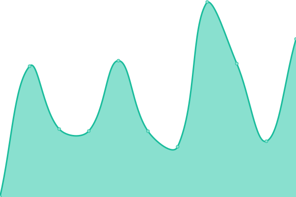
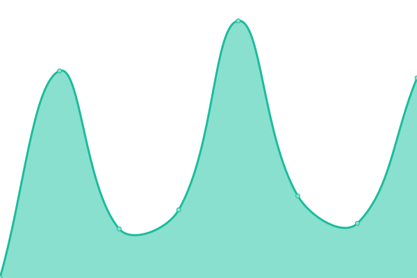

# [📈 Live Status](https://demo.upptime.js.org): <!--live status--> **🟩 All systems operational**

This repository contains the open-source uptime monitor and status page for [Nordfjord24](https://demo.upptime.js.org), powered by [Upptime](https://github.com/upptime/upptime).

With [Upptime](https://upptime.js.org), you can get your own unlimited and free uptime monitor and status page, powered entirely by a GitHub repository. We use [Issues](https://github.com/Nordfjord24/uptime2.0/issues) as incident reports, [Actions](https://github.com/Nordfjord24/uptime2.0/actions) as uptime monitors, and [Pages](https://demo.upptime.js.org) for the status page.

<!--start: status pages-->
<!-- This summary is generated by Upptime (https://github.com/upptime/upptime) -->
<!-- Do not edit this manually, your changes will be overwritten -->
<!-- prettier-ignore -->
| URL | Status | History | Response Time | Uptime |
| --- | ------ | ------- | ------------- | ------ |
|  [Sahara](https://www.sahara.is) | 🟩 Up | [sahara.yml](https://github.com/Nordfjord24/uptime2.0/commits/HEAD/history/sahara.yml) | 

 520ms
     
 | 

<a href="https://Nordfjord24.github.io/uptime2.0/history/sahara">100.00%</a>
    

|  [Sahara Agency](https://www.saharaagency.net) | 🟩 Up | [sahara-agency.yml](https://github.com/Nordfjord24/uptime2.0/commits/HEAD/history/sahara-agency.yml) | 

 213ms
     
 | 

<a href="https://Nordfjord24.github.io/uptime2.0/history/sahara-agency">100.00%</a>
    

|  [NFJ MEDIA](https://www.nfjmedia.com) | 🟩 Up | [nfj-media.yml](https://github.com/Nordfjord24/uptime2.0/commits/HEAD/history/nfj-media.yml) | 

 196ms
     
 | 

<a href="https://Nordfjord24.github.io/uptime2.0/history/nfj-media">100.00%</a>
    

<!--end: status pages-->

[**Visit our status website →**](https://demo.upptime.js.org)

## 📄 License

- Powered by: [Upptime](https://github.com/upptime/upptime)
- Code: [MIT](./LICENSE) © [Nordfjord24](https://demo.upptime.js.org)
- Data in the `./history` directory: [Open Database License](https://opendatacommons.org/licenses/odbl/1-0/)
